# 医院在线管理系统

本仓库为**医院在线管理系统**相关工程，包含《医院管理系统》**需求基线文档**与 **.NET 8 WPF** 客户端骨架（`Hospital.sln` / `src/Hospital.App`）。

**注意**：Cursor 计划文件（`.cursor/plans/...`）不在此仓库内维护；需求正文以 `docs/` 为准迭代版本号。

## 运行客户端

**环境**：Windows，已安装 [.NET 8 SDK](https://dotnet.microsoft.com/download/dotnet/8.0)。

```powershell
cd e:\Demo\Cursor\Hospital
dotnet build Hospital.sln -c Release
dotnet run --project src\Hospital.App\Hospital.App.csproj -c Release
```

启动后主窗为**顶栏 + 左侧菜单 + 右侧内容区**；`NavigationService` 已注册 `shell.home`、`mdm.campus`、`opd.register`（暂均指向占位页，后续按 [docs/WPF_UI_INVENTORY.md](docs/WPF_UI_INVENTORY.md) 拆分真实视图）。

## 文档索引

| 文档 | 说明 |
|------|------|
| [docs/PRODUCT_SCOPE_CONFIRMATIONS.md](docs/PRODUCT_SCOPE_CONFIRMATIONS.md) | 服务范围、监护、收费医保、部署等**确认结论** |
| [docs/ROLE_PERMISSION_MATRIX.md](docs/ROLE_PERMISSION_MATRIX.md) | 角色 × 功能域权限矩阵 |
| [docs/CORE_FLOWS.md](docs/CORE_FLOWS.md) | 核心业务流程（Mermaid） |
| [docs/USER_STORIES_EPICS.md](docs/USER_STORIES_EPICS.md) | Epic 与用户故事初版 |
| [docs/WPF_ARCHITECTURE.md](docs/WPF_ARCHITECTURE.md) | WPF 分层、MVVM、导航契约 |
| [docs/WPF_UI_INVENTORY.md](docs/WPF_UI_INVENTORY.md) | UI Key、RouteKey、权限码对照 |
| [docs/WPF_UI_DECISIONS.md](docs/WPF_UI_DECISIONS.md) | 门诊 Tab、叫号大屏、重症波形等 UI 实施结论 |
| [docs/DATABASE_SCHEMA_PLAN.md](docs/DATABASE_SCHEMA_PLAN.md) | 数据库表清单、分表设计与脚本索引（与 `database/` 同步） |
| [database/README.md](database/README.md) | **SQL Server** 建库/建表脚本说明与执行顺序 |

## 解决方案结构

| 路径 | 说明 |
|------|------|
| [Hospital.sln](Hospital.sln) | Visual Studio / `dotnet` 解决方案 |
| [src/Hospital.App](src/Hospital.App) | WPF 启动项目 |

## 代码结构图

```mermaid
graph TD
    A[Hospital] --> B[Hospital.sln]
    A --> C[README.md]
    A --> D[database/]
    D --> D1[000_init_database.sql]
    D --> D2[001_mdm_organization.sql]
    D --> D3[002_mdm_dictionary.sql]
    D --> D4[003_sec_security.sql]
    D --> D5[004_pat_empi.sql]
    D --> D6[005_opd_schedule.sql]
    D --> D7[006_opd_registration.sql]
    D --> D8[007_clinical_encounter.sql]
    D --> D9[008_clinical_orders_split.sql]
    D --> D10[009_pha_drug.sql]
    D --> D11[010_eqp_asset.sql]
    D --> D12[011_mon_monitoring.sql]
    D --> D13[012_ipd_inpatient.sql]
    D --> D14[013_rad_report.sql]
    D --> D15[014_fin_billing.sql]
    D --> D16[015_rpt_meta.sql]
    D --> D17[900_seed_minimal.sql]
    D --> D18[README.md]
    A --> E[docs/]
    E --> E1[CORE_FLOWS.md]
    E --> E2[DATABASE_SCHEMA_PLAN.md]
    E --> E3[PRODUCT_SCOPE_CONFIRMATIONS.md]
    E --> E4[ROLE_PERMISSION_MATRIX.md]
    E --> E5[USER_STORIES_EPICS.md]
    E --> E6[WPF_ARCHITECTURE.md]
    E --> E7[WPF_UI_DECISIONS.md]
    E --> E8[WPF_UI_INVENTORY.md]
    A --> F[src/]
    F --> G[Hospital.App/]
    G --> G1[App.xaml]
    G --> G2[App.xaml.cs]
    G --> G3[AssemblyInfo.cs]
    G --> G4[Hospital.App.csproj]
    G --> G5[MainWindow.xaml]
    G --> G6[MainWindow.xaml.cs]
    G --> H[bin/]
    H --> H1[Debug/net8.0-windows/]
    H --> H2[Release/net8.0-windows/]
    G --> I[obj/]
    I --> I1[Hospital.App.csproj.nuget.dgspec.json]
    I --> I2[project.assets.json]
    I --> I3[Debug/net8.0-windows/]
    I --> I4[Release/net8.0-windows/]
    G --> J[Services/]
    J --> J1[ApiClient.cs]
    J --> J2[ApiModels.cs]
    J --> J3[ApplicationContext.cs]
    J --> J4[AuthenticationService.cs]
    J --> J5[IApiClient.cs]
    J --> J6[IAppContext.cs]
    J --> J7[IAuthenticationService.cs]
    J --> J8[INavigationService.cs]
    J --> J9[NavigationService.cs]
    G --> K[ViewModels/]
    K --> K1[LoginViewModel.cs]
    K --> K2[MainWindowViewModel.cs]
    G --> L[Views/]
    L --> L1[LoginWindow.xaml]
    L --> L2[LoginWindow.xaml.cs]
    L --> M[Placeholder/]
    M --> M1[HomePlaceholderView.xaml]
    M --> M2[HomePlaceholderView.xaml.cs]
```



### 项目代码结构说明

**Hospital** 项目是一个基于 WPF 和 .NET 8 的医院管理系统，采用 MVVM 架构。整体结构分为解决方案文件、数据库脚本、文档和源代码四个主要部分。

- **Hospital.sln**：Visual Studio 解决方案文件，用于管理整个项目的构建和依赖。
- **README.md**：项目根目录的说明文档，概述项目背景和使用指南。
- **database/**：包含数据库初始化和数据迁移脚本，按编号顺序执行（如 000_init_database.sql 初始化数据库，900_seed_minimal.sql 填充最小种子数据），支持医院系统的核心数据模型（组织、患者、门诊、住院等）。
- **docs/**：项目文档文件夹，包括核心业务流程、数据库架构计划、产品范围确认、角色权限矩阵、用户故事、WPF 架构和 UI 决策等，帮助理解系统设计和开发规范。
- **src/Hospital.App/**：主应用源代码目录。
  - **App.xaml/cs**：WPF 应用启动文件，定义应用级资源和生命周期。
  - **MainWindow.xaml/cs**：主窗口视图和代码后置，应用的主界面入口。
  - **Services/**：服务层，实现业务逻辑，如 API 客户端（ApiClient.cs）、认证服务（AuthenticationService.cs）、导航服务（NavigationService.cs）和应用上下文（ApplicationContext.cs），遵循依赖注入模式。
  - **ViewModels/**：视图模型层，采用 MVVM 模式，处理 UI 逻辑，如登录视图模型（LoginViewModel.cs）和主窗口视图模型（MainWindowViewModel.cs）。
  - **Views/**：视图层，包含 XAML 视图文件，如登录窗口（LoginWindow.xaml）和占位符视图（Placeholder/HomePlaceholderView.xaml）。
  - **bin/** 和 **obj/**：构建输出目录，分别存放可执行文件和中间编译产物（Debug 和 Release 配置）。

该结构支持模块化开发，便于维护和扩展医院系统的各项功能。

1. 在 `PRODUCT_SCOPE_CONFIRMATIONS.md` 中补充**医保首发省市**与接口厂商信息。  
2. 在 SQL Server 上按 [database/README.md](database/README.md) 顺序执行 `000`–`015` 与可选 `900_seed_minimal.sql`，验证建表与扩展属性。  
3. 实现 `IApiClient` 与后端 API 契约，按 `WPF_UI_INVENTORY` 逐路由注册真实 `UserControl`。  
4. 增加登录窗体并将 `ApplicationContext` 与令牌从登录结果注入。
