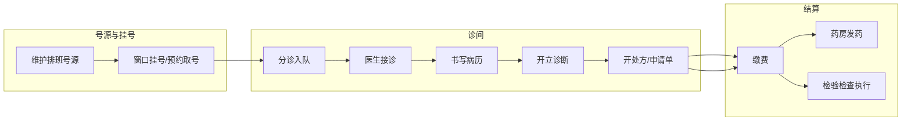
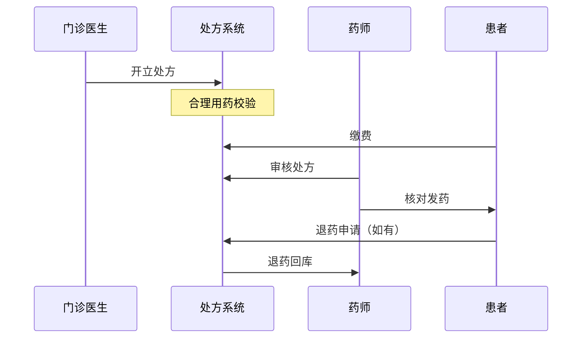

# 🏥 医院在线管理系统（Hospital Online Management System）

> 基于 .NET 8 + DDD + WPF + Vue 3 的全栈医院信息系统（HIS），覆盖门诊、收费、药房、检验检查等核心医疗流程，支持多院区统一管理。

---

## 📋 目录

- [项目概述](#-项目概述)
- [技术栈](#-技术栈)
- [系统架构](#-系统架构)
- [项目结构](#-项目结构)
- [功能模块](#-功能模块)
- [API 清单](#-api-清单)
- [WPF 桌面客户端](#-wpf-桌面客户端)
- [Web 管理端](#-web-管理端)
- [微信小程序](#-微信小程序)
- [数据库设计](#-数据库设计)
- [用户角色与权限](#-用户角色与权限)
- [业务流程](#-业务流程)
- [快速开始](#-快速开始)
- [部署指南](#-部署指南)
- [开发规范](#-开发规范)
- [当前进度](#-当前进度)
- [文档索引](#-文档索引)

---

## 📌 项目概述

本项目是一个**面向集团的院内信息管理系统（HIS）**，旨在为医院提供日常业务数字化工具，覆盖门诊、急诊全流程，支撑临床决策，实现精细化管理。

### 核心业务范围

```
患者来院
  ├─ ① 建档（初诊）/ 查档（复诊）         ← 挂号员
  ├─ ② 挂号 / 取号                        ← 挂号员 / 自助机
  ├─ ③ 分诊排队                            ← 分诊护士
  ├─ ④ 医生接诊                            ← 门诊/急诊医生
  │     ├─ 书写病历 + 诊断
  │     ├─ 开立检验/检查申请
  │     ├─ 开立处方
  │     └─ 转诊 / 住院申请
  ├─ ⑤ 缴费                                ← 收费员 / 自助
  ├─ ⑥ 执行
  │     ├─ 药房取药                         ← 药师
  │     ├─ 检验科采样                       ← 医技
  │     └─ 检查科室拍片                     ← 医技
  └─ ⑦ 报告回传（医生站查阅）
```

### 关键设计目标

| 目标 | 说明 |
|------|------|
| **多院区统一管理** | 一套系统支撑集团下多个院区的独立运营与统一管控 |
| **门诊全流程闭环** | 建档 → 挂号 → 接诊 → 开单 → 缴费 → 发药，数据不落空 |
| **RBAC 安全基线** | 基于角色的权限控制，院区/科室数据域隔离 |
| **灵活部署** | 支持 Docker Compose、Kubernetes、IIS 多种部署方式 |
| **多端覆盖** | WPF 桌面端（医护）、Web 管理端（信息科）、微信小程序（患者） |

---

## 🛠 技术栈

| 层 | 技术 | 说明 |
|----|------|------|
| **后端框架** | ASP.NET Core 8 + C# 12 | 跨平台 REST API |
| **架构模式** | **DDD**（领域驱动设计） | Domain → Application → Infrastructure → Presentation |
| **ORM** | Entity Framework Core 8 | Fluent API，Code First，SQL Server |
| **数据库** | SQL Server 2019+ | 9 个 Schema，27+ 张表 |
| **认证** | JWT（JSON Web Token） | 无状态认证，支持刷新令牌 |
| **API 文档** | Swagger / Swashbuckle | 自动生成，含 XML 注释 |
| **日志** | Serilog | 文件日志，按天滚动 |
| **映射** | 手动 DTO 映射 | 保持领域层纯净 |
| **桌面客户端** | **WPF** (.NET 8) | MVVM 架构，CommunityToolkit.Mvvm |
| **Web 管理端** | **Vue 3** + TypeScript + Vite | Naive UI 组件库，Pinia 状态管理 |
| **微信小程序** | 微信原生开发 | 患者端预约、挂号、缴费、报告查询 |
| **容器化** | Docker + Kubernetes | 多阶段构建，K8s 部署清单 |
| **CI/CD** | Docker Compose | 本地三容器编排（SQL Server + API + Web） |

---

## 🏗 系统架构

### 分层架构（DDD）

```
┌─────────────────────────────────────────────────┐
│              Presentation Layer                  │
│  ┌─────────────────┐  ┌──────────────────────┐  │
│  │  Hospital.Api    │  │   Hospital.App       │  │
│  │  (ASP.NET Core)  │  │   (WPF Desktop)      │  │
│  └────────┬────────┘  └──────────┬───────────┘  │
└───────────┼──────────────────────┼──────────────┘
            │ 引用                  │ 引用
┌───────────▼──────────────────────▼──────────────┐
│           Application Layer                      │
│  ┌────────────────────────────────────────────┐  │
│  │  Hospital.Application                       │  │
│  │  ├── Services/      应用服务（用例编排）    │  │
│  │  ├── DTOs/          数据传输对象             │  │
│  │  ├── Repositories/ 仓储接口                 │  │
│  │  └── Constants/    常量与权限码              │  │
│  └────────────────────┬───────────────────────┘  │
└────────────────────────┼──────────────────────────┘
                         │ 引用
┌────────────────────────▼────────────────────────┐
│           Domain Layer                            │
│  ┌────────────────────────────────────────────┐  │
│  │  Hospital.Domain                            │  │
│  │  ├── Entities/      实体                    │  │
│  │  ├── Aggregates/    聚合根                  │  │
│  │  ├── ValueObjects/  值对象                  │  │
│  │  ├── Enums/         枚举                    │  │
│  │  └── Events/        领域事件                │  │
│  └────────────────────────────────────────────┘  │
└──────────────────────────────────────────────────┘
                         │ 引用
┌────────────────────────▼────────────────────────┐
│         Infrastructure Layer                      │
│  ┌────────────────────────────────────────────┐  │
│  │  Hospital.Infrastructure                    │  │
│  │  ├── Data/          EF Core DbContext       │  │
│  │  ├── Repositories/ 仓储实现（EF Core）     │  │
│  │  └── ExternalServices/ 外部服务集成         │  │
│  └────────────────────────────────────────────┘  │
└──────────────────────────────────────────────────┘
```

### 依赖方向

```
Hospital.Domain          -- 纯领域模型，零外部依赖
     ↑
Hospital.Application     -- 应用服务 + DTO + 仓储接口，只依赖 Domain
     ↑
Hospital.Infrastructure  -- 基础设施实现，依赖 Domain + Application
     ↑
Hospital.Api / App       -- 表示层，依赖 Application + Infrastructure
```

**严禁反向依赖**：Domain 层不得引用任何其他项目，保持领域模型纯净。

---

## 📁 项目结构

```
Hospital.sln                              -- Visual Studio 解决方案
│
├── src/                                   -- 源代码
│   │
│   ├── Hospital.Domain/                   -- 🎯 领域模型层（纯业务逻辑）
│   │   ├── Entity.cs                      --    实体基类（Id + 基于身份的比较）
│   │   ├── AggregateRoot.cs               --    聚合根基类（含领域事件集合）
│   │   ├── Entities/                      --    实体
│   │   │   ├── AuditLog.cs                --      审计日志
│   │   │   ├── Billing.cs                 --      账单
│   │   │   ├── BillingItem.cs             --      账单明细
│   │   │   ├── Campus.cs                  --      院区
│   │   │   ├── Department.cs              --      科室
│   │   │   ├── Diagnosis.cs               --      诊断
│   │   │   ├── DictionaryItem.cs          --      字典项
│   │   │   ├── DictionaryType.cs          --      字典类型
│   │   │   ├── DispenseItem.cs            --      发药明细
│   │   │   ├── Dispensing.cs              --      发药单
│   │   │   ├── DrugInventory.cs           --      药品库存
│   │   │   ├── Encounter.cs               --      就诊记录
│   │   │   ├── LabOrder.cs                --      检验申请
│   │   │   ├── MedicalRecord.cs           --      病历
│   │   │   ├── Payment.cs                 --      支付记录
│   │   │   ├── Prescription.cs            --      处方
│   │   │   ├── PrescriptionItem.cs         --      处方明细
│   │   │   ├── RadOrder.cs                --      检查申请
│   │   │   ├── Registration.cs            --      挂号记录
│   │   │   ├── Role.cs                    --      角色
│   │   │   ├── Staff.cs                   --      员工
│   │   │   ├── User.cs                    --      用户
│   │   │   └── WeChatAccount.cs           --      微信账号
│   │   ├── Aggregates/                    --    聚合根
│   │   │   ├── Patient/                   --      患者聚合
│   │   │   │   ├── Patient.cs             --        患者聚合根
│   │   │   │   └── Events/                --        患者领域事件
│   │   │   └── Schedule/                  --      排班聚合
│   │   │       └── Schedule.cs            --        排班聚合根
│   │   ├── ValueObjects/                  --    值对象
│   │   │   ├── CampusCode.cs              --      院区编码
│   │   │   ├── DepartmentCode.cs          --      科室编码
│   │   │   ├── Gender.cs                  --      性别
│   │   │   ├── IdCard.cs                  --      身份证号
│   │   │   ├── LicenseNumber.cs           --      执业证号
│   │   │   ├── PhoneNumber.cs             --      手机号
│   │   │   └── WeChatOpenId.cs            --      微信 OpenId
│   │   ├── Enums/                         --    枚举
│   │   │   ├── BillingStatus.cs           --      账单状态
│   │   │   ├── DepartmentType.cs          --      科室类型
│   │   │   ├── DiagnosisType.cs           --      诊断类型
│   │   │   ├── DispenseStatus.cs          --      发药状态
│   │   │   ├── EncounterStatus.cs         --      就诊状态
│   │   │   ├── LicenseType.cs             --      执业类型
│   │   │   ├── OrderStatus.cs             --      医嘱状态
│   │   │   ├── PaymentMethod.cs           --      支付方式
│   │   │   ├── PrescriptionStatus.cs      --      处方状态
│   │   │   ├── RecordStatus.cs            --      病历状态
│   │   │   ├── RegistrationStatus.cs      --      挂号状态
│   │   │   └── ScheduleStatus.cs          --      排班状态
│   │   └── Events/                        --    领域事件基类
│   │       └── DomainEvent.cs             --      事件基类（含 OccurredOn）
│   │
│   ├── Hospital.Application/              -- 🎯 应用服务层
│   │   ├── Services/                      --    应用服务
│   │   │   ├── Authentication/            --      认证服务
│   │   │   ├── Campus/                    --      院区服务
│   │   │   ├── Department/               --      科室服务
│   │   │   ├── Staff/                     --      人员服务
│   │   │   ├── Dictionary/               --      字典服务
│   │   │   ├── Patient/                   --      患者服务
│   │   │   ├── Schedule/                  --      排班服务
│   │   │   ├── Registration/              --      挂号服务
│   │   │   ├── Encounter/                 --      就诊服务
│   │   │   ├── MedicalRecord/            --      病历服务
│   │   │   ├── Diagnosis/                 --      诊断服务
│   │   │   ├── Prescription/              --      处方服务
│   │   │   ├── LabOrder/                  --      检验服务
│   │   │   ├── Cashier/                   --      收费服务
│   │   │   ├── Dispense/                  --      发药服务
│   │   │   ├── UserRole/                  --      用户角色服务
│   │   │   └── WeChat/                    --      微信服务
│   │   ├── DTOs/                          --    数据传输对象（sealed record）
│   │   │   ├── AuthenticationDTOs.cs      --      登录/登出 DTO
│   │   │   ├── OrganizationDTOs.cs        --      院区/科室/人员 DTO
│   │   │   ├── DictionaryDTOs.cs          --      字典 DTO
│   │   │   ├── PatientDTOs.cs             --      患者 DTO
│   │   │   ├── RegistrationDTOs.cs        --      挂号 DTO
│   │   │   ├── ScheduleDTOs.cs            --      排班 DTO
│   │   │   ├── EncounterDTOs.cs           --      就诊/病历/诊断 DTO
│   │   │   ├── PrescriptionDTOs.cs        --      处方 DTO
│   │   │   ├── CashierDTOs.cs             --      收费 DTO
│   │   │   ├── UserRoleDTOs.cs            --      用户角色 DTO
│   │   │   └── WeChatAuthDTOs.cs          --      微信认证 DTO
│   │   ├── Repositories/                  --    仓储接口（19 个）
│   │   │   ├── IPatientRepository.cs
│   │   │   ├── ICampusRepository.cs
│   │   │   ├── IDepartmentRepository.cs
│   │   │   ├── IStaffRepository.cs
│   │   │   ├── IDictionaryRepository.cs
│   │   │   ├── IScheduleRepository.cs
│   │   │   ├── IRegistrationRepository.cs
│   │   │   ├── IEncounterRepository.cs
│   │   │   ├── IMedicalRecordRepository.cs
│   │   │   ├── IDiagnosisRepository.cs
│   │   │   ├── IPrescriptionRepository.cs
│   │   │   ├── ILabOrderRepository.cs
│   │   │   ├── IRadOrderRepository.cs
│   │   │   ├── IBillingRepository.cs
│   │   │   ├── IDispenseRepository.cs
│   │   │   ├── IDrugInventoryRepository.cs
│   │   │   ├── IAuditLogRepository.cs
│   │   │   ├── IUserRepository.cs
│   │   │   └── IRoleRepository.cs
│   │   └── Constants/                     --    常量定义
│   │       ├── Constants.cs               --      通用常量
│   │       └── Permissions.cs             --      权限码常量
│   │
│   ├── Hospital.Infrastructure/           -- 🎯 基础设施层
│   │   ├── Data/                          --    EF Core 数据访问
│   │   │   ├── HospitalDbContext.cs        --      数据库上下文（含 Fluent API 配置）
│   │   │   └── ValueConverters.cs          --      值对象转换器
│   │   ├── Repositories/                  --    仓储实现（EF Core）
│   │   │   ├── EfPatientRepository.cs
│   │   │   ├── EfCampusRepository.cs
│   │   │   ├── EfDepartmentRepository.cs
│   │   │   ├── EfStaffRepository.cs
│   │   │   ├── EfDictionaryRepository.cs
│   │   │   ├── EfScheduleRepository.cs
│   │   │   ├── EfRegistrationRepository.cs
│   │   │   ├── EfEncounterRepository.cs
│   │   │   ├── EfMedicalRecordRepository.cs
│   │   │   ├── EfDiagnosisRepository.cs
│   │   │   ├── EfPrescriptionRepository.cs
│   │   │   ├── EfLabOrderRepository.cs
│   │   │   ├── EfRadOrderRepository.cs
│   │   │   ├── EfBillingRepository.cs
│   │   │   ├── EfDispenseRepository.cs
│   │   │   ├── EfDrugInventoryRepository.cs
│   │   │   ├── EfAuditLogRepository.cs
│   │   │   ├── EfUserRepository.cs
│   │   │   └── EfRoleRepository.cs
│   │   └── ExternalServices/              --    外部服务
│   │       ├── JwtTokenService.cs          --      JWT Token 生成/验证
│   │       ├── LocalAuthenticationService.cs --   本地认证（内存用户）
│   │       ├── LocalUserStore.cs           --      内存用户存储
│   │       ├── WeChatHttpClient.cs         --      微信 API HTTP 客户端
│   │       ├── WeChatAuthService.cs        --      微信登录认证
│   │       ├── PatientNoService.cs         --      患者编号生成
│   │       ├── PatientService.cs           --      患者服务实现
│   │       └── ...其他服务实现
│   │
│   ├── Hospital.Api/                      -- 🎯 ASP.NET Core Web API
│   │   ├── Program.cs                     --    启动配置（DI、中间件、CORS、JWT）
│   │   ├── Controllers/                   --    API 控制器（20 个）
│   │   │   ├── AuthenticationController.cs
│   │   │   ├── PatientController.cs
│   │   │   ├── CampusController.cs
│   │   │   ├── DepartmentController.cs
│   │   │   ├── StaffController.cs
│   │   │   ├── DictionaryController.cs
│   │   │   ├── ScheduleController.cs
│   │   │   ├── RegistrationController.cs
│   │   │   ├── EncounterController.cs
│   │   │   ├── DiagnosisController.cs
│   │   │   ├── MedicalRecordController.cs
│   │   │   ├── PrescriptionController.cs
│   │   │   ├── LabOrderController.cs
│   │   │   ├── CashierController.cs
│   │   │   ├── DispenseController.cs
│   │   │   ├── UserController.cs
│   │   │   ├── RoleController.cs
│   │   │   ├── AuditLogController.cs
│   │   │   └── MiniProgramAuthController.cs
│   │   ├── Middleware/
│   │   │   └── ExceptionMiddleware.cs     --    全局异常处理
│   │   ├── Filters/
│   │   │   └── ApiLogFilter.cs            --    API 访问日志过滤器
│   │   ├── appsettings.json               --    应用配置（JWT、数据库连接串）
│   │   ├── appsettings.Development.json   --    开发环境配置
│   │   └── Dockerfile                     --    Docker 多阶段构建
│   │
│   └── Hospital.App/                      -- 🎯 WPF 桌面客户端
│       ├── App.xaml / App.xaml.cs          --    应用入口、资源定义
│       ├── MainWindow.xaml / .cs           --    主窗口（顶栏 + 侧边栏 + 内容区）
│       ├── Views/                         --    视图层（XAML，15+ 页面）
│       │   ├── LoginWindow.xaml / .cs      --      登录窗口
│       │   ├── CampusView.xaml / .cs       --      院区管理
│       │   ├── DepartmentView.xaml / .cs   --      科室管理
│       │   ├── DictionaryView.xaml / .cs   --      字典管理
│       │   ├── StaffView.xaml / .cs        --      人员管理
│       │   ├── ScheduleView.xaml / .cs     --      排班管理
│       │   ├── RegisterWorkbenchView.xaml / .cs --  挂号工作台
│       │   ├── EncounterWorkbenchView.xaml / .cs --门诊医生站
│       │   ├── PatientSearchView.xaml / .cs --     患者检索
│       │   ├── PatientRegisterView.xaml / .cs --   患者建档
│       │   ├── Patient360View.xaml / .cs   --      患者 360 视图
│       │   ├── CashierWorkbenchView.xaml / .cs --  收费工作台
│       │   ├── DispenseWorkbenchView.xaml / .cs -- 发药工作台
│       │   ├── UserRoleView.xaml / .cs     --      用户角色管理
│       │   └── Placeholder/               --      待实现占位页
│       ├── ViewModels/                    --    视图模型层（MVVM）
│       │   ├── LoginViewModel.cs
│       │   ├── MainWindowViewModel.cs
│       │   ├── CampusViewModel.cs
│       │   ├── DepartmentViewModel.cs
│       │   ├── DictionaryViewModel.cs
│       │   ├── StaffListViewModel.cs
│       │   ├── ScheduleViewModel.cs
│       │   ├── RegisterWorkbenchViewModel.cs
│       │   ├── EncounterWorkbenchViewModel.cs
│       │   ├── PatientSearchViewModel.cs
│       │   ├── PatientRegisterViewModel.cs
│       │   ├── Patient360ViewModel.cs
│       │   ├── CashierWorkbenchViewModel.cs
│       │   ├── DispenseWorkbenchViewModel.cs
│       │   ├── UserRoleViewModel.cs
│       │   └── HomePlaceholderViewModel.cs
│       ├── Services/                      --    服务层
│       │   ├── INavigationService.cs       --      导航接口
│       │   ├── NavigationService.cs        --      导航实现（路由注册与切换）
│       │   ├── IAppContext.cs              --      应用上下文接口
│       │   ├── ApplicationContext.cs       --      用户上下文单例
│       │   ├── AuthDelegatingHandler.cs    --      JWT 自动附加
│       │   ├── IStartupService.cs          --      启动服务接口
│       │   └── AppStartup.cs               --      启动流程编排
│       ├── Converters/                    --    值转换器
│       │   ├── BoolToVisibilityConverter.cs
│       │   ├── BoolToInverseConverter.cs
│       │   └── StringToVisibilityConverter.cs
│       ├── Constants/
│       │   └── AppConstants.cs            --    应用常量
│       └── ServiceCollectionExtensions.cs --    DI 注册扩展
│
├── hospital-web/                          -- 🌐 Vue 3 Web 管理端
│   ├── src/
│   │   ├── main.ts                        --    入口
│   │   ├── App.vue                        --    根组件
│   │   ├── router/index.ts                --    路由（含导航守卫 + 权限校验）
│   │   ├── stores/auth.ts                 --    Pinia 认证状态管理
│   │   ├── api/                           --    API 调用层（Axios + JWT 拦截器）
│   │   │   ├── request.ts                 --      HTTP 客户端封装
│   │   │   ├── auth.ts                    --      认证 API
│   │   │   ├── campus.ts                  --      院区 API
│   │   │   ├── department.ts              --      科室 API
│   │   │   ├── staff.ts                   --      人员 API
│   │   │   ├── dictionary.ts              --      字典 API
│   │   │   ├── patient.ts                 --      患者 API
│   │   │   ├── schedule.ts                --      排班 API
│   │   │   └── userRole.ts                --      用户角色 API
│   │   ├── pages/                         --    页面组件
│   │   │   ├── login/index.vue             --      登录页
│   │   │   ├── dashboard/index.vue         --      仪表盘
│   │   │   ├── campus/index.vue            --      院区管理
│   │   │   ├── department/index.vue        --      科室管理
│   │   │   ├── staff/index.vue             --      人员管理
│   │   │   ├── dictionary/index.vue        --      字典管理
│   │   │   ├── patient/                    --      患者管理
│   │   │   │   ├── search.vue              --        患者检索
│   │   │   │   ├── create.vue              --        患者建档
│   │   │   │   └── detail.vue              --        患者详情
│   │   │   ├── schedule/index.vue          --      排班管理
│   │   │   ├── user/index.vue              --      用户管理
│   │   │   └── role/index.vue              --      角色管理
│   │   ├── components/
│   │   │   ├── AppLayout.vue               --    主布局（侧边栏 + 顶栏 + 内容区）
│   │   │   └── AppMain.vue                 --    主要内容区
│   │   ├── types/index.ts                 --    TypeScript 类型定义
│   │   ├── utils/constants.ts             --    常量
│   │   └── style.css                      --    全局样式
│   ├── Dockerfile                         --    Nginx 多阶段构建
│   ├── nginx.conf                         --    SPA 路由 + API 反代
│   └── vite.config.ts                     --    Vite 构建配置
│
├── hospital-miniapp/                      -- 📱 微信小程序（患者端）
│   ├── app.js / app.json / app.wxss       --    小程序应用配置
│   ├── pages/                             --    页面
│   │   ├── index/                         --      首页（医院介绍 + 功能入口）
│   │   ├── login/                         --      微信一键登录
│   │   ├── dept/list                      --      科室列表
│   │   ├── doctor/schedule                --      医生排班选择
│   │   ├── appointment/                    --      预约挂号
│   │   │   ├── confirm                    --        确认预约
│   │   │   ├── success                    --        预约成功
│   │   │   └── records                    --        预约记录
│   │   ├── queue/status                   --      排队状态查询
│   │   ├── profile/                       --      个人中心
│   │   │   ├── index                      --        个人主页
│   │   │   ├── patients/                  --        就诊人管理
│   │   │   ├── settings                   --        设置
│   │   │   └── detail/index               --        个人信息详情
│   │   ├── visit/                         --      就诊记录
│   │   ├── report/                        --      报告查询
│   │   └── payment/                       --      在线支付
│   ├── services/                          --    服务层
│   │   ├── wechat-auth-service.js          --      微信认证
│   │   ├── auth-service.js                 --      登录认证
│   │   ├── patient-service.js              --      患者服务
│   │   ├── registration-service.js         --      挂号服务
│   │   ├── schedule-service.js             --      排班服务
│   │   ├── dept-service.js                 --      科室服务
│   │   ├── campus-service.js               --      院区服务
│   │   ├── staff-service.js                --      人员服务
│   │   └── encounter-service.js            --      就诊服务
│   ├── components/                        --    公共组件
│   ├── styles/                            --    样式文件
│   ├── utils/                             --    工具函数
│   └── assets/                            --    静态资源
│
├── database/                              -- 🗄 数据库脚本
│   ├── init_full.sql                      --    一键执行脚本（建库+建表+种子数据）
│   ├── 000_init_database.sql              --    建库、建 Schema、所有表
│   ├── 002_migrate_hourly_slots.sql       --    排班时段迁移（小时制）
│   ├── 010_wechat_login.sql               --    微信登录相关表
│   ├── 900_seed_minimal.sql               --    最小演示数据（院区、科室、人员、用户、字典）
│   ├── 901_seed_data.sql                  --    全量测试数据（患者、排班、挂号、就诊、发药）
│   ├── 999_verify_seed_data.sql           --    验证数据行数
│   ├── scripts/                           --    辅助脚本
│   │   ├── seed_doctor1.py                --      医生演示数据生成
│   │   ├── seed_schedule.py               --      排班数据 Python 生成器
│   │   ├── seed_schedule.sql              --      排班数据 SQL
│   │   ├── seed_schedule_final.sql
│   │   ├── seed_schedule_fix.sql
│   │   └── _patch_staff.py                --      员工数据修补
│   └── old_schema/                        --    旧版本建表脚本（归档）
│
├── deploy/                                -- 🚀 部署配置
│   ├── docker-compose.yml                 --    三容器编排（SQL Server + API + Web）
│   ├── Dockerfile.hotfix                  --    热修复 Dockerfile
│   └── k8s/                               --    Kubernetes 部署清单（10 个 YAML）
│       ├── namespace.yaml                 --      命名空间 hospital
│       ├── api-secret.yaml                --      JWT 密钥 + SA 密码
│       ├── api-configmap.yaml             --      连接字符串 + 环境变量
│       ├── api-deployment.yaml            --      API 部署（2 副本）
│       ├── api-service.yaml               --      API Service
│       ├── web-deployment.yaml            --      Web 前端部署
│       ├── web-service.yaml               --      Web 前端 Service
│       ├── sqlserver-statefulset.yaml     --      SQL Server StatefulSet
│       ├── sqlserver-service.yaml         --      SQL Server Service
│       └── ingress.yaml                   --      Ingress 路由
│
├── docs/                                  -- 📚 项目文档
│   ├── DDD_RULES.md                       --    DDD 编码规范
│   ├── DESIGN.md                          --    架构设计记录
│   ├── PROJECT_PLAN.md                    --    项目总体规划
│   ├── CORE_FLOWS.md                      --    核心业务流程图
│   ├── PRODUCT_SCOPE_CONFIRMATIONS.md     --    产品范围确认
│   ├── ROLE_PERMISSION_MATRIX.md          --    角色权限矩阵
│   ├── USER_STORIES_EPICS.md              --    用户故事与 Epic
│   ├── DATABASE_SCHEMA_PLAN.md            --    数据库架构计划
│   ├── WPF_ARCHITECTURE.md                --    WPF 架构设计
│   ├── WPF_UI_INVENTORY.md                --    WPF UI 清单与路由表
│   ├── WPF_UI_DECISIONS.md                --    WPF UI 实施决策
│   ├── V1_STATUS.md                       --    V1 功能实现状态
│   ├── V1_TASKS.md                        --    V1 任务清单
│   ├── V1_REMAINING.md                    --    V1 剩余待办
│   ├── WEB_PLAN.md                        --    Web 端开发计划
│   ├── WECHAT_MINI_PROGRAM_PLAN.md        --    小程序开发计划
│   ├── WECHAT_LOGIN_REQUIREMENTS.md       --    微信登录需求
│   ├── WECHAT_LOGIN_IMPL.md               --    微信登录实现说明
│   ├── DEPLOY_STEPS.md                    --    部署步骤
│   ├── DEPLOY_COMMANDS.md                 --    部署命令参考
│   ├── DEPLOY_LOG.md                      --    部署日志
│   └── IIS_DEPLOY.md                      --    IIS 部署指南
│
└── CLAUDE.md                              -- 项目规范与 AI 助手指令

```

---

## 🎯 功能模块

### V1 核心模块（10 大模块）

| # | 模块 | 后端 API | WPF 界面 | 说明 |
|---|------|---------|---------|------|
| ① | **认证与导航** | ✅ JWT 登录/登出 | ✅ 登录窗口 + 主框架 | 一切功能的基础 |
| ② | **组织主数据** | ✅ 院区/科室/人员 CRUD | ✅ 真实页面 | 多院区模型前提 |
| ③ | **字典管理** | ✅ 字典类型/项 CRUD | ✅ 真实页面 | 病历处方的依赖 |
| ④ | **患者建档** | ✅ 患者 EMPI CRUD | ✅ 真实页面 | 就诊入口 |
| ⑤ | **挂号** | ✅ 排班 + 窗口挂号 + 退号 | ✅ 真实页面 | 门诊核心入口 |
| ⑥ | **门诊医生站** | ✅ 病历 + 诊断 + 处方 + 申请 | ✅ 真实页面 | 临床核心 |
| ⑦ | **发药** | ✅ 处方审核 + 发药 | ✅ 真实页面 | 处方闭环 |
| ⑧ | **收费** | ✅ 处方/检验检查缴费 + 退费 | ✅ 真实页面 | 财务闭环 |
| ⑨ | **患者检索** | ✅ 多条件检索 + 360 视图 | ✅ 真实页面 | 日常高频操作 |
| ⑩ | **用户与权限** | ✅ 用户/角色 CRUD + RBAC | ✅ 真实页面 | 安全基线 |

### 扩展模块

| 模块 | 后端 API | 说明 |
|------|---------|------|
| **微信小程序** | ✅ MiniProgramAuth | 患者端微信一键登录、预约、挂号、报告查询 |
| **检验检查** | ✅ LabOrder / RadOrder | 检验检查申请开立与管理 |
| **病历管理** | ✅ MedicalRecord | 门诊病历书写、草稿与终稿 |
| **诊断管理** | ✅ Diagnosis | 诊断录入（ICD 编码） |
| **处方管理** | ✅ Prescription | 门诊处方开立与管理 |
| **药品库存** | ✅ DrugInventory | 药品库存管理 |
| **审计日志** | ✅ AuditLog | API 访问与操作审计 |

---

## 📡 API 清单

### 认证模块

| 方法 | 路由 | 说明 | 认证 |
|------|------|------|------|
| POST | `/api/authentication/login` | 用户登录，返回 JWT Token | ❌ |
| POST | `/api/authentication/logout` | 用户登出 | ✅ |

### 患者管理

| 方法 | 路由 | 说明 |
|------|------|------|
| GET | `/api/patient/{id}` | 按 ID 查询患者 |
| GET | `/api/patient/no/{patientNo}` | 按病历号查询 |
| GET | `/api/patient/search` | 多条件模糊搜索（姓名/身份证/手机号） |
| GET | `/api/patient/page` | 分页查询患者列表 |
| POST | `/api/patient` | 新建患者档案 |
| PUT | `/api/patient/{id}` | 更新患者信息 |
| DELETE | `/api/patient/{id}` | 删除患者 |

### 院区管理

| 方法 | 路由 | 说明 |
|------|------|------|
| GET | `/api/campus/list` | 院区列表 |
| GET | `/api/campus/{id}` | 院区详情 |
| POST | `/api/campus` | 新建院区 |
| PUT | `/api/campus/{id}` | 更新院区 |
| DELETE | `/api/campus/{id}` | 删除院区 |

### 科室管理

| 方法 | 路由 | 说明 |
|------|------|------|
| GET | `/api/department/list` | 科室树/列表 |
| GET | `/api/department/{id}` | 科室详情 |
| POST | `/api/department` | 新建科室 |
| PUT | `/api/department/{id}` | 更新科室 |
| DELETE | `/api/department/{id}` | 删除科室 |

### 人员管理

| 方法 | 路由 | 说明 |
|------|------|------|
| GET | `/api/staff/list` | 人员列表 |
| GET | `/api/staff/{id}` | 人员详情 |
| POST | `/api/staff` | 新建人员 |
| PUT | `/api/staff/{id}` | 更新人员 |
| DELETE | `/api/staff/{id}` | 删除人员 |
| PUT | `/api/staff/{id}/license` | 更新执业信息 |

### 字典管理

| 方法 | 路由 | 说明 |
|------|------|------|
| GET | `/api/dictionary/types` | 字典类型列表 |
| GET | `/api/dictionary/type/{code}/items` | 某类型的字典项 |
| POST | `/api/dictionary/type` | 新建字典类型 |
| PUT | `/api/dictionary/type/{id}` | 更新字典类型 |
| POST | `/api/dictionary/item` | 新建字典项 |
| PUT | `/api/dictionary/item/{id}` | 更新字典项 |
| DELETE | `/api/dictionary/item/{id}` | 删除字典项 |

### 排班管理

| 方法 | 路由 | 说明 |
|------|------|------|
| GET | `/api/schedule/list` | 排班列表 |
| GET | `/api/schedule/{id}` | 排班详情（含时段） |
| POST | `/api/schedule` | 新建排班 |
| PUT | `/api/schedule/{id}/publish` | 发布排班 |
| PUT | `/api/schedule/{id}/stop` | 停用排班 |
| GET | `/api/schedule/available` | 可预约排班查询 |
| GET | `/api/schedule/doctor/{doctorId}` | 医生排班查询 |

### 挂号管理

| 方法 | 路由 | 说明 |
|------|------|------|
| POST | `/api/registration` | 窗口挂号 |
| POST | `/api/registration/cancel` | 退号 |
| GET | `/api/registration/{id}` | 挂号详情 |
| GET | `/api/registration/today` | 今日挂号列表 |
| GET | `/api/registration/queue` | 候诊队列 |

### 就诊管理

| 方法 | 路由 | 说明 |
|------|------|------|
| GET | `/api/encounter/queue` | 就诊队列 |
| POST | `/api/encounter/start` | 开始接诊 |
| POST | `/api/encounter/complete` | 结束就诊 |

### 病历管理

| 方法 | 路由 | 说明 |
|------|------|------|
| GET | `/api/medical-record/{encounterId}` | 获取就诊病历 |
| POST | `/api/medical-record` | 保存病历（草稿/终稿） |

### 诊断管理

| 方法 | 路由 | 说明 |
|------|------|------|
| POST | `/api/diagnosis` | 开立诊断 |
| GET | `/api/diagnosis/encounter/{encounterId}` | 就诊诊断列表 |

### 处方管理

| 方法 | 路由 | 说明 |
|------|------|------|
| POST | `/api/prescription` | 开立处方 |
| GET | `/api/prescription/{id}` | 处方详情 |
| GET | `/api/prescription/encounter/{encounterId}` | 就诊处方列表 |

### 检验检查

| 方法 | 路由 | 说明 |
|------|------|------|
| POST | `/api/lab-order` | 开立检验申请 |
| GET | `/api/lab-order/encounter/{encounterId}` | 就诊检验列表 |

### 收费管理

| 方法 | 路由 | 说明 |
|------|------|------|
| GET | `/api/cashier/charge-items` | 待收费项目列表 |
| POST | `/api/cashier/pay` | 缴费 |
| POST | `/api/cashier/refund` | 退费 |

### 发药管理

| 方法 | 路由 | 说明 |
|------|------|------|
| GET | `/api/dispense/pending-list` | 待发药处方列表 |
| POST | `/api/dispense/dispense` | 确认发药 |

### 用户与角色

| 方法 | 路由 | 说明 |
|------|------|------|
| GET | `/api/user/list` | 用户列表 |
| POST | `/api/user` | 新建用户 |
| PUT | `/api/user/{id}` | 更新用户 |
| GET | `/api/role/list` | 角色列表 |
| POST | `/api/role` | 新建角色 |
| PUT | `/api/role/{id}` | 更新角色 |

### 微信小程序

| 方法 | 路由 | 说明 |
|------|------|------|
| POST | `/api/miniprogram/auth/login` | 微信一键登录 |
| POST | `/api/miniprogram/auth/refresh` | 刷新 Token |

---

## 🖥 WPF 桌面客户端

### 界面结构

```
┌─────────────────────────────────────────────────────────┐
│  🏥 华西医院 HIS 系统     [院区: 主院区]  👤 admin     │
├──────────┬──────────────────────────────────────────────┤
│          │                                              │
│  📋 导航  │     内容区 (ContentControl)                  │
│          │                                              │
│  🏠 首页  │  ┌──────────────────────────────────────┐   │
│  📁 主数据 │  │                                      │   │
│    ├ 院区  │  │  根据 RouteKey 动态加载对应 View      │   │
│    ├ 科室  │  │                                      │   │
│    ├ 人员  │  │  - CampusView                        │   │
│    └ 字典  │  │  - DepartmentView                    │   │
│  👤 患者   │  │  - EncounterWorkbenchView             │   │
│    ├ 建档  │  │  - RegisterWorkbenchView              │   │
│    ├ 检索  │  │  - CashierWorkbenchView               │   │
│    └ 360   │  │  - ...                               │   │
│  🏥 门诊   │  └──────────────────────────────────────┘   │
│    ├ 排班  │                                              │
│    ├ 挂号  │                                              │
│    └ 医生站│                                              │
│  💊 药房   │                                              │
│    └ 发药  │                                              │
│  💰 收费   │                                              │
│  ⚙ 系统   │                                              │
│    └ 用户  │                                              │
│          │                                              │
└──────────┴──────────────────────────────────────────────┘
```

### 路由注册表

| RouteKey | 视图 | 说明 |
|----------|------|------|
| `shell.home` | `HomePlaceholderView` | 首页仪表盘 |
| `mdm.campus` | `CampusView` | 🟢 院区管理 |
| `mdm.department` | `DepartmentView` | 🟢 科室管理 |
| `mdm.staff` | `StaffView` | 🟢 人员管理 |
| `mdm.dictionary` | `DictionaryView` | 🟢 字典管理 |
| `opd.schedule` | `ScheduleView` | 🟢 排班管理 |
| `opd.register` | `RegisterWorkbenchView` | 🟢 挂号工作台 |
| `opd.encounter` | `EncounterWorkbenchView` | 🟢 门诊医生站 |
| `pat.search` | `PatientSearchView` | 🟢 患者检索 |
| `pat.register` | `PatientRegisterView` | 🟢 患者建档 |
| `pat.detail` | `Patient360View` | 🟢 患者全景视图 |
| `pha.dispense` | `DispenseWorkbenchView` | 🟢 发药工作台 |
| `fin.cashier` | `CashierWorkbenchView` | 🟢 收费工作台 |
| `sys.user` | `UserRoleView` | 🟢 用户与角色管理 |

### 架构模式

- **MVVM 模式**：View + ViewModel + Model 三层分离
- **CommunityToolkit.Mvvm**：源生成器、`ObservableObject`、`RelayCommand`
- **导航系统**：`NavigationService` 管理路由注册与页面切换
- **依赖注入**：构造器注入所有服务
- **JWT 认证**：`AuthDelegatingHandler` 自动为 HTTP 请求附加 Token

### 应用服务

| 服务 | 说明 |
|------|------|
| `INavigationService` | 页面导航（RouteKey 路由） |
| `IAppContext` / `ApplicationContext` | 用户上下文单例（用户信息、Token、院区） |
| `IApiClient` / `ApiClient` | HTTP API 客户端 |
| `IAuthenticationService` | 认证服务（登录/登出） |
| `IStartupService` / `AppStartup` | 启动流程编排 |

---

## 🌐 Web 管理端

### 页面清单

| 路由 | 页面 | 说明 | 权限码 |
|------|------|------|--------|
| `/login` | 登录页 | 用户名密码登录 | 无需认证 |
| `/dashboard` | 仪表盘 | 运营数据概览 | `sys.shell.use` |
| `/campus` | 院区管理 | 院区 CRUD | `mdm.campus.manage` |
| `/department` | 科室管理 | 科室树管理 | `mdm.dept.manage` |
| `/staff` | 人员管理 | 人员档案 CRUD | `mdm.staff.manage` |
| `/dictionary` | 字典管理 | 字典类型/项 CRUD | `mdm.dict.manage` |
| `/patient/create` | 患者建档 | 新建患者档案 | `pat.register` |
| `/patient/search` | 患者检索 | 多条件搜索 | `pat.search` |
| `/patient/detail/:id` | 患者详情 | 360 视图 | `pat.search` |
| `/schedule` | 排班管理 | 排班发布管理 | `opd.schedule` |
| `/users` | 用户管理 | 系统用户 CRUD | `sys.security.manage` |
| `/roles` | 角色管理 | 角色与权限配置 | `sys.security.manage` |

### 安全特性

- **导航守卫**：未登录自动跳转登录页
- **路由级权限**：基于权限码控制页面访问
- **Axios 拦截器**：自动附加 JWT Token、401 自动跳转登录
- **Pinia 状态管理**：认证状态全局共享

---

## 📱 微信小程序

患者端小程序，提供便捷的移动医疗服务。

### 页面清单

| 页面路径 | 说明 |
|----------|------|
| `pages/index/index` | 首页（医院介绍、功能入口） |
| `pages/login/login` | 微信一键登录 |
| `pages/dept/list` | 科室列表 |
| `pages/doctor/schedule` | 医生排班选择 |
| `pages/appointment/confirm` | 预约确认 |
| `pages/appointment/success` | 预约成功 |
| `pages/appointment/records` | 预约记录 |
| `pages/queue/status` | 排队状态查询 |
| `pages/profile/profile` | 个人中心 |
| `pages/profile/patients/index` | 就诊人管理 |
| `pages/profile/patients/edit` | 就诊人编辑 |
| `pages/profile/settings` | 设置 |
| `pages/profile/detail/index` | 个人信息详情 |

### 后端支撑

- **微信登录**：`MiniProgramAuthController` + `WeChatAuthService`
- **JWT 颁发**：微信 Code → OpenId → JWT Token → 小程序本地存储
- **API 网关**：统一通过后端 API 获取数据

---

## 🗄 数据库设计

### Schema 架构（9 个 Schema）

| Schema | 说明 | 核心表 |
|--------|------|--------|
| `sec` | 安全与认证 | `Users`, `Roles`, `UserRoles`, `AuditLogs` |
| `mdm` | 主数据 | `Campuses`, `Departments`, `Staffs`, `DictionaryTypes`, `DictionaryItems`, `ChargeItems` |
| `pat` | 患者 | `Patients`, `PatientIdentifiers`, `PatientConsents`, `WeChatAccounts` |
| `opd` | 门诊 | `Schedules`, `ScheduleSlots`, `Registrations` |
| `enc` | 就诊 | `Encounters`, `Diagnoses`, `MedicalRecords` |
| `pha` | 药房 | `DrugInventories`, `Dispensings`, `DispenseItems` |
| `fin` | 财务 | `Billings`, `BillingItems`, `Payments` |
| `lab` | 检验检查 | `LabOrders`, `RadOrders` |
| `cal` | 日历 | 排班时段配置 |

### 种子数据

| 登录名 | 密码 | 角色 |
|--------|------|------|
| `admin` | `admin123` | 系统管理员 |
| `doctor` | `doctor123` | 门诊医生 |
| `reg` | `reg123` | 挂号员 |
| `cash` | `cash123` | 收费员 |
| `pharm` | `pharm123` | 药剂师 |

数据包含：12 名患者、3 个院区、11 名员工、角色/用户/字典数据、过去 14 天排班及时段、过去 7 天挂号数据、就诊/诊断/病历/处方/发药/收费数据。

---

## 👥 用户角色与权限

### 角色定义

| 角色 | 说明 | 主要功能域 |
|------|------|-----------|
| 系统管理员 | 系统全功能管理 | 所有模块 |
| 信息科 | 系统维护与配置 | M1 主数据、M13 系统安全 |
| 挂号员 | 窗口挂号 | M2 患者建档、M3 挂号 |
| 分诊护士 | 分诊叫号 | M3 分诊叫号 |
| 门诊医生 | 门诊接诊 | M5 病历/处方/申请 |
| 住院医生 | 住院诊疗 | M9 医嘱 |
| 护士 | 护理执行 | M8 生命体征、M9 医嘱执行、护理文书 |
| 药师 | 门诊/住院发药 | M6 发药/退药 |
| 药库 | 药品管理 | M6 药品入库/盘点 |
| 收费员 | 窗口收费 | M11 收费/退费 |
| 医保办 | 医保对账 | M11 医保结算 |
| 设备科 | 设备管理 | M7 设备台账/工单 |
| 运营/报表 | 数据统计分析 | M12 报表 |
| 患者（互联网端）| 自助服务 | M4 预约（小程序） |

### 权限模型

- **RBAC**（Role-Based Access Control）：用户 → 角色 → 权限
- **院区数据域**：用户默认仅能访问授权院区数据
- **科室数据域**：临床角色默认绑定科室/病区

完整矩阵见 [docs/ROLE_PERMISSION_MATRIX.md](docs/ROLE_PERMISSION_MATRIX.md)。

---

## 🔄 业务流程

### 门诊就诊闭环



### 药品流转



更多流程图见 [docs/CORE_FLOWS.md](docs/CORE_FLOWS.md)。

---

## 🚀 快速开始

### 环境要求

- [.NET 8 SDK](https://dotnet.microsoft.com/download/dotnet/8.0)
- SQL Server 2019+（本地或远程 Docker）
- Node.js 20+（Web 前端）
- 微信开发者工具（小程序开发）

### 1. 克隆并初始化数据库

```powershell
# 一键执行（建库 + 建表 + 种子数据）
sqlcmd -S localhost -C -I -f i:65001 -U sa -P "Hospital@2024" -b -i "database\init_full.sql"
```

### 2. 启动后端 API

```bash
cd e:\Demo\Cursor\Hospital
dotnet run --project src/Hospital.Api --launch-profile "http"
```

- API 地址：`http://localhost:5000`
- Swagger 文档：`http://localhost:5000/swagger`
- 首次启动自动 CreateDatabase + 种子患者数据

### 3. 启动 WPF 桌面客户端

```powershell
dotnet run --project src\Hospital.App
```

登录后即可使用完整的门诊功能。

### 4. 启动 Web 管理端

```bash
cd hospital-web
npm install
npm run dev
```

- 地址：`http://localhost:5173`

### 5. 小程序开发（可选）

在微信开发者工具中导入 `hospital-miniapp/` 目录，配置 `project.config.json` 中的 AppID 即可。

---

## 🚢 部署指南

### Docker Compose（本地三容器）

```bash
cd deploy
docker-compose up -d
```

编排包含：
- `sqlserver`：SQL Server 2019 容器
- `api`：ASP.NET Core API
- `web`：Nginx + Vue 3 SPA

### Kubernetes

```bash
kubectl apply -f deploy/k8s/namespace.yaml
kubectl apply -f deploy/k8s/
```

包含 10 个 YAML 清单：命名空间、Secret、ConfigMap、API 部署（2 副本）、Web 部署、SQL Server StatefulSet、Service、Ingress。

### IIS 部署

参见 [docs/IIS_DEPLOY.md](docs/IIS_DEPLOY.md) 详细步骤。

---

## 📐 开发规范

### DDD 编码规则

```csharp
// ✅ 正确：Entity setter 私有化，通过业务方法修改状态
public class Patient : AggregateRoot
{
    public string Name { get; private set; }

    private Patient() { }  // EF Core 要求

    public Patient(string name)
    {
        Name = name;
        AddDomainEvent(new PatientCreatedEvent(Id, name));
    }

    public void UpdateName(string newName)
    {
        if (string.IsNullOrWhiteSpace(newName))
            throw new ArgumentException("姓名不能为空");
        Name = newName;
    }
}

// ✅ 正确：DTO 使用 sealed record
public sealed record PatientDto(
    long Id, string PatientNo, string Name,
    string? Gender, string? BirthDate);

// ✅ 正确：Repository 接口返回领域对象
public interface IPatientRepository
{
    Task<Patient?> GetByIdAsync(long id);
    Task AddAsync(Patient patient);
}
```

### 关键约定

| 约定 | 说明 |
|------|------|
| **Async 后缀** | 所有异步方法添加 `Async` 后缀 |
| **仓储命名** | `AddAsync` / `UpdateAsync` / `DeleteAsync` / `GetByIdAsync` |
| **DTO** | 使用 `sealed record`（不可变、值比较、解构支持） |
| **Entity setter** | 私有化，状态变更通过业务方法 |
| **依赖注入** | 构造器注入，禁止 `new` 创建服务 |
| **聚合边界** | 外部只能通过聚合根操作内部实体 |
| **跨聚合通信** | 领域事件驱动，禁止直接修改多个聚合 |

完整规范见 [docs/DDD_RULES.md](docs/DDD_RULES.md)。

---

## 📊 当前进度

### 状态总结

| 维度 | 进度 | 说明 |
|------|------|------|
| 后端 API | **~90%** | 20 个控制器，覆盖 V1 全部 10 大模块 |
| 领域模型 | **~85%** | 24+ 实体、12 枚举、7 值对象、领域事件机制 |
| 数据持久化 | **✅ 完成** | EF Core DbContext + 19 个仓储实现 |
| 数据库 Schema | **✅ 完成** | 9 Schema、27+ 表、种子数据就绪 |
| WPF 桌面端 | **~70%** | 15+ 真实页面，MVVM 架构，导航系统 |
| Web 管理端 | **~60%** | 12 个页面，路由权限控制 |
| 微信小程序 | **~70%** | 13 个页面，预约挂号全流程 |
| 部署配置 | **✅ 完成** | Docker Compose + K8s + IIS |

### 已完成的模块

- ✅ **认证与导航**：JWT 登录/登出、WPF 登录窗口 + 主框架、Web 登录
- ✅ **组织主数据**：院区/科室/人员 CRUD（API + WPF + Web）
- ✅ **字典管理**：字典类型/项 CRUD（API + WPF + Web）
- ✅ **患者建档与检索**：患者 EMPI、模糊搜索、360 视图（全端覆盖）
- ✅ **排班管理**：号源维护、发布/停用、时段管理（小时制 7 时段）
- ✅ **挂号**：窗口挂号、退号、挂号查询
- ✅ **门诊医生站**：病历书写（草稿/终稿）、诊断、处方、检验检查申请
- ✅ **收费**：处方/检验检查缴费、退费
- ✅ **发药**：处方审核、发药确认
- ✅ **用户与权限**：用户/角色管理、RBAC 权限控制
- ✅ **微信小程序**：一键登录、预约挂号、就诊人管理、排队查询
- ✅ **审计日志**：API 操作日志记录
- ✅ **数据库**：完整 Schema + EF Core 映射 + 种子数据
- ✅ **部署**：Docker、K8s、IIS 全套配置

### 进行中与待实现

- 🚧 **Domain 事件派发**：事件已收集但未派发（待事件总线）
- 🚧 **住院管理**：入院登记、床位管理、医嘱执行（V2）
- 🚧 **叫号大屏**：候诊区大屏显示
- 🚧 **医保接口**：真实医保联调
- 🚧 **报表中心**：运营统计报表
- 📝 **单元测试**：Domain / Application / API 测试覆盖

---

## 📚 文档索引

| 分类 | 文档 | 说明 |
|------|------|------|
| 📐 **架构规范** | [docs/DDD_RULES.md](docs/DDD_RULES.md) | DDD 代码规范（分层、实体、值对象、仓储、事件） |
| | [docs/DESIGN.md](docs/DESIGN.md) | 架构与设计决策记录 |
| | [docs/PROJECT_PLAN.md](docs/PROJECT_PLAN.md) | 项目总体规划与分期 |
| 🎯 **需求** | [docs/PRODUCT_SCOPE_CONFIRMATIONS.md](docs/PRODUCT_SCOPE_CONFIRMATIONS.md) | 产品范围确认 |
| | [docs/USER_STORIES_EPICS.md](docs/USER_STORIES_EPICS.md) | Epic 与用户故事 |
| | [docs/ROLE_PERMISSION_MATRIX.md](docs/ROLE_PERMISSION_MATRIX.md) | 角色 × 功能域权限矩阵 |
| 🔄 **流程** | [docs/CORE_FLOWS.md](docs/CORE_FLOWS.md) | 核心业务流程（Mermaid） |
| 🗄 **数据库** | [docs/DATABASE_SCHEMA_PLAN.md](docs/DATABASE_SCHEMA_PLAN.md) | 数据库架构计划 |
| | [database/README.md](database/README.md) | 数据库脚本说明与执行顺序 |
| 🖥 **WPF** | [docs/WPF_ARCHITECTURE.md](docs/WPF_ARCHITECTURE.md) | WPF 分层、MVVM、导航契约 |
| | [docs/WPF_UI_INVENTORY.md](docs/WPF_UI_INVENTORY.md) | UI Key、RouteKey、权限码对照 |
| | [docs/WPF_UI_DECISIONS.md](docs/WPF_UI_DECISIONS.md) | UI 实施结论 |
| 📱 **小程序** | [docs/WECHAT_MINI_PROGRAM_PLAN.md](docs/WECHAT_MINI_PROGRAM_PLAN.md) | 小程序开发计划 |
| | [docs/WECHAT_LOGIN_REQUIREMENTS.md](docs/WECHAT_LOGIN_REQUIREMENTS.md) | 微信登录需求 |
| | [docs/WECHAT_LOGIN_IMPL.md](docs/WECHAT_LOGIN_IMPL.md) | 微信登录实现 |
| 🌐 **Web** | [docs/WEB_PLAN.md](docs/WEB_PLAN.md) | Web 前端开发计划 |
| 📊 **进度** | [docs/V1_STATUS.md](docs/V1_STATUS.md) | V1 功能实现状态 |
| | [docs/V1_TASKS.md](docs/V1_TASKS.md) | V1 任务清单 |
| | [docs/V1_REMAINING.md](docs/V1_REMAINING.md) | V1 剩余待办 |
| 🚢 **部署** | [docs/DEPLOY_STEPS.md](docs/DEPLOY_STEPS.md) | 部署步骤 |
| | [docs/DEPLOY_COMMANDS.md](docs/DEPLOY_COMMANDS.md) | 部署命令参考 |
| | [docs/DEPLOY_LOG.md](docs/DEPLOY_LOG.md) | 部署日志 |
| | [docs/IIS_DEPLOY.md](docs/IIS_DEPLOY.md) | IIS 部署指南 |

---

## 🧪 测试账号

| 登录名 | 密码 | 角色 | 说明 |
|--------|------|------|------|
| `admin` | `admin123` | 🛡 系统管理员 | 系统全功能管理 |
| `doctor` | `doctor123` | 🩺 门诊医生 | 门诊接诊、处方 |
| `reg` | `reg123` | 📋 挂号员 | 窗口挂号 |
| `cash` | `cash123` | 💰 收费员 | 窗口收费 |
| `pharm` | `pharm123` | 💊 药剂师 | 药房发药 |

---

## 🤝 贡献指南

1. 遵循 [DDD_RULES.md](docs/DDD_RULES.md) 编码规范
2. 所有异步方法使用 `Async` 后缀
3. Entity setter 私有化，通过业务方法变更状态
4. DTO 使用 `sealed record`
5. 仓储操作使用 `AddAsync` / `UpdateAsync` / `DeleteAsync` / `GetByIdAsync`
6. 提交前确保 `dotnet build` 无错误

---

## 📝 许可证

本项目为内部医院管理系统，仅供授权人员使用。
