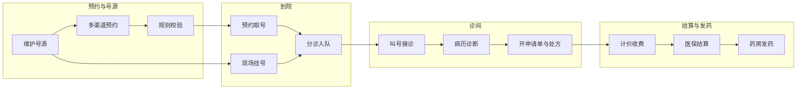
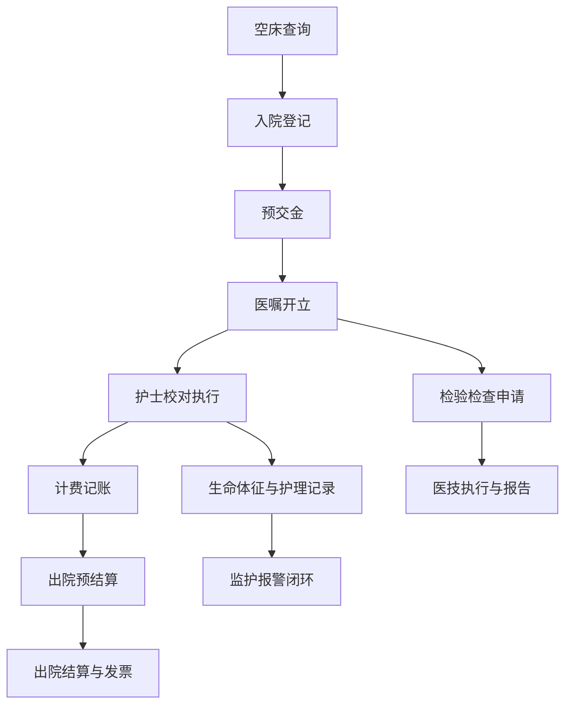
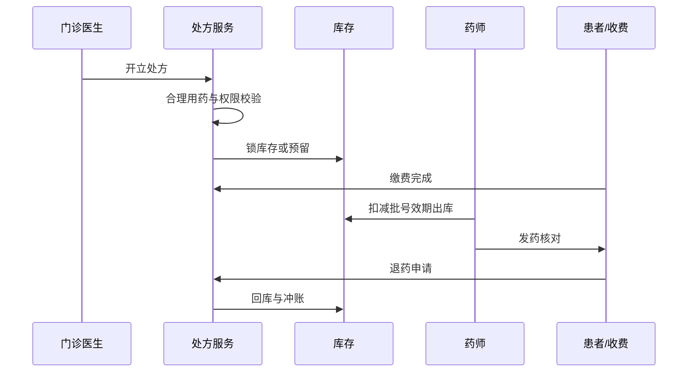
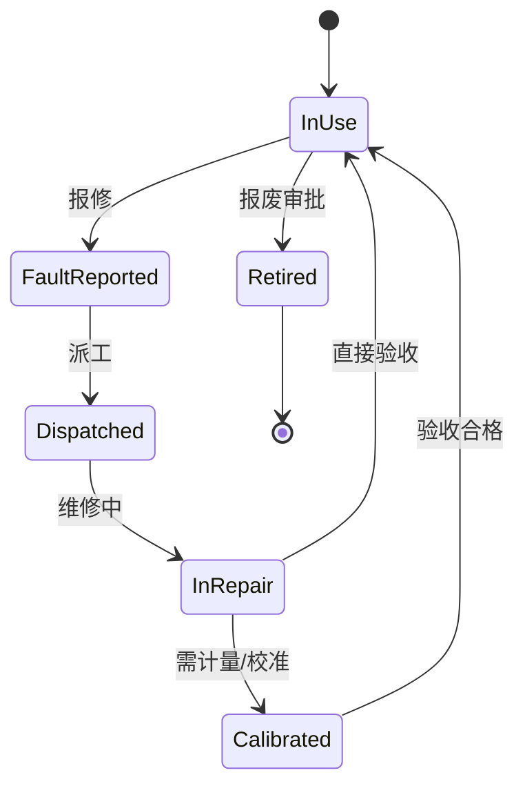
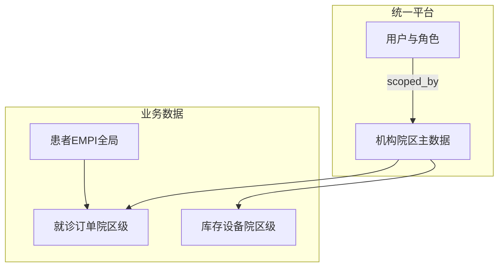

# 核心业务流程（初版）

与需求清单 §3–§11 对齐，供架构设计与集成测试用例编写。图中节点采用 camelCase。

---

## 1. 预约到诊门诊闭环

---

## 2. 住院入出转与医嘱护理

---

## 3. 药品：处方到发药与退药

---

## 4. 设备：报修到关闭

---

## 5. 危急值与监护报警（统一闭环）

---

## 6. 多院区数据域（概念）

---

## 修订记录

| 版本 | 说明 |
|------|------|
| 1.0 | 与需求清单初版对齐 |
