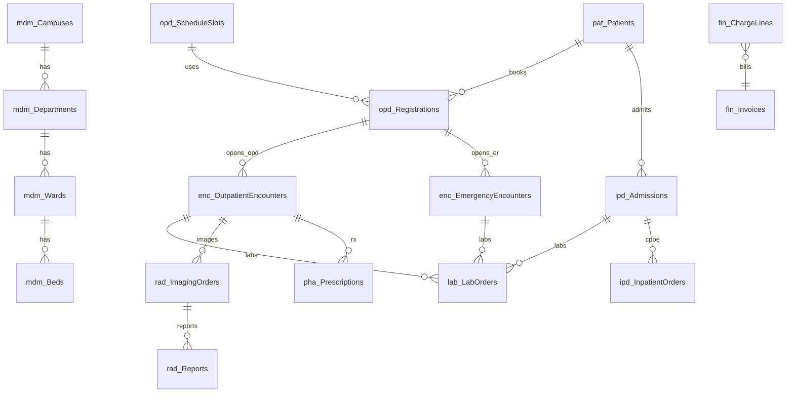

# 医院管理系统 — 数据库脚本设计清单（待确认）

**版本**：0.4（草案）  
**对齐文档**：[PRODUCT_SCOPE_CONFIRMATIONS.md](PRODUCT_SCOPE_CONFIRMATIONS.md)、[WPF_UI_INVENTORY.md](WPF_UI_INVENTORY.md)（模块 M1–M13）。  
**实现脚本**：[database/README.md](../database/README.md)

**已确认结论**

- **数据库产品**：**Microsoft SQL Server 2019+**（T-SQL）。后续 DDL 与迁移脚本均按此编写；PostgreSQL 平行脚本不在范围，除非另行提出。
- **表模型（分表）**：**不按**泛化 `cli.Orders` 单表承载全部医嘱/申请；采用 **按业务域硬拆（分表）**（检验、检查、处方、住院医嘱等各自成组表）。详见 §3.4。
- **就诊（分表）**：**门诊就诊**与**急诊就诊**各一张主表；病历、诊断等子表采用 **可空双外键互斥**（`OutpatientEncounterId` / `EmergencyEncounterId`）+ `CHECK`，避免单表 `EncounterType` 混载。详见 §3.3。

---

## 1. 请你先确认的 4 项前提

| # | 事项 | 建议默认 | 你确认 / 修订 |
|---|------|----------|----------------|
| 1 | **数据库产品** | **Microsoft SQL Server 2019+**（T-SQL） | **已确认：SQL Server** |
| 2 | **字符集与排序** | SQL Server：`NVARCHAR` + 库级 `Chinese_PRC_CI_AS`（或院方规定） | |
| 3 | **多院区模型** | 业务表普遍带 **`CampusId`**（`BIGINT`），与 `mdm.Campuses` 关联；集团级参数放 `mdm.Organizations` | |
| 4 | **软删除与审计** | 重要业务表：`IsDeleted`、`DeletedAt`；审计：`CreatedAt`、`CreatedByUserId`、`UpdatedAt`、`UpdatedByUserId`；敏感表另挂 `sec.AuditLogs` 明细 | |

---

## 2. 脚本文件拆分（建议文件名，便于 CI 顺序执行）

| 序号 | 文件 | 内容范围 |
|------|------|----------|
| 000 | `000_init_database.sql` | 创建数据库 `Hospital`、各业务 **架构**（含 `sec`）、`dbo.sp_AddDescription` |
| 001 | `001_mdm_organization.sql` | 机构、院区、科室树、病区床位、人员与科室关系 |
| 002 | `002_mdm_dictionary.sql` | 字典类型/项、收费项目、医嘱途径频次等 |
| 003 | `003_sec_security.sql` | 用户、角色、权限、角色权限、系统参数、集成端点、审计（**`sec` 架构**） |
| 004 | `004_pat_empi.sql` | 患者主索引、证件、合并日志、隐私授权 |
| 005 | `005_opd_schedule.sql` | 排班、号源时段、停诊替诊 |
| 006 | `006_opd_registration.sql` | 预约、挂号订单、分诊队列入队记录 |
| 007 | `007_clinical_encounter.sql` | **门诊就诊**、**急诊就诊**（分表）、病历与诊断（互斥外键） |
| 008 | `008_clinical_orders_split.sql` | **分表**：`lab` 检验申请、`rad` 检查申请、`pha` 处方（门诊/住院引用各自就诊/入院） |
| 009 | `009_pha_drug.sql` | 药品目录、批号库存、入出库流水、发药退药（与 `pha.Prescriptions` 衔接，依赖 008 中处方对象） |
| 010 | `010_eqp_asset.sql` | 设备台账、领用借还、巡检、工单、计量 |
| 011 | `011_mon_monitoring.sql` | 生命体征、护理文书扩展、危急值、ICU 波形元数据、远程设备绑定 |
| 012 | `012_ipd_inpatient.sql` | 入院、床位、转科转床、预交金、**`ipd.InpatientOrders` 与执行**（与分表处方/检验检查并存时的院规在 DDL 注释中说明） |
| 013 | `013_rad_report.sql` | 医技预约、到检、报告索引与危急值上报 |
| 014 | `014_fin_billing.sql` | 费用明细、结算单、发票接口流水、退费红冲、医保交易与对账批次 |
| 015 | `015_rpt_meta.sql` | 报表定义、导出任务（可选） |
| 900 | `900_seed_minimal.sql` | 最小种子：管理员、根科室、字典样例、院区样例 |

---

## 3. 表清单（按模块）

### 3.1 M1 / M2 — 主数据 `mdm` + 患者 `pat`

| 表名 | 说明 | 关键字段（草案） |
|------|------|------------------|
| `mdm.Organizations` | 集团/法人机构 | `Id`, `Name`, `Code`, `IsActive` |
| `mdm.Campuses` | 院区 | `Id`, `OrganizationId`, `Name`, `Code`, `IsActive` |
| `mdm.Departments` | 科室树 | `Id`, `CampusId`, `ParentId`, `Name`, `DeptType`, `IsClinical`, `IsActive` |
| `mdm.Wards` | 病区 | `Id`, `CampusId`, `DepartmentId`, `Name`, `IsActive` |
| `mdm.Beds` | 床位 | `Id`, `WardId`, `BedNo`, `Status`, `OccupiedByAdmissionId`（可空，外键在 `012` 添加） |
| `mdm.Staff` | 人员 | `Id`, `CampusId`（主属）, `EmployeeNo`, `FullName`, `StaffCategory`, `LicenseNo`, `LicenseExpireDate` |
| `mdm.StaffDepartments` | 人员科室多对多 | `StaffId`, `DepartmentId`, `IsPrimary`, `StartDate`, `EndDate` |
| `mdm.DictionaryTypes` | 字典分类 | `Code`, `Name`, `IsSystem` |
| `mdm.DictionaryItems` | 字典项 | `TypeCode`, `Value`, `DisplayName`, `SortOrder`, `IsActive` |
| `mdm.ChargeItems` | 收费物价项目 | `Code`, `Name`, `Unit`, `Price`, `Category`, `IsActive` |
| `pat.Patients` | EMPI 患者主档 | `Id`, `PatientNo`, `IdCardNo`（可空）, `Name`, `Gender`, `BirthDate`, `Phone`, `AllergiesText` |
| `pat.PatientIdentifiers` | 多证件/卡号 | `PatientId`, `IdType`, `IdValue`, `IsPrimary` |
| `pat.PatientMergeLogs` | 合并审计 | `SurvivorPatientId`, `MergedPatientId`, `MergedByUserId`, `MergedAt`, `PayloadJson` |
| `pat.PatientConsents` | 隐私授权 | `PatientId`, `ConsentType`, `GrantedAt`, `ExpiresAt`, `DocumentRef` |

### 3.2 M13 — 系统与安全 `sec`（脚本实现；**勿使用架构名 `sys`**，其为 SQL Server 系统保留）

| 表名 | 说明 | 关键字段 |
|------|------|----------|
| `sec.Users` | 登录用户 | `LoginName`, `PasswordHash`, `StaffId`（可空）, `IsLocked`, `LastLoginAt` |
| `sec.Roles` | 角色 | `Code`, `Name`, `CampusId`（可空表示跨院区模板） |
| `sec.UserRoles` | 用户角色 | `UserId`, `RoleId`, `CampusId` |
| `sec.Permissions` | 权限点 | `Code`（与 UI 权限码对齐）, `Module`, `Description` |
| `sec.RolePermissions` | 角色权限 | `RoleId`, `PermissionId` |
| `sec.SystemParameters` | 全院参数 | `CampusId`（可空=全局）, `ParamKey`, `ParamValue`, `ValueType` |
| `sec.IntegrationEndpoints` | 集成端点 | `Name`, `BaseUrl`, `AuthType`, `ConfigJson`, `IsActive` |
| `sec.AuditLogs` | 审计 | `UserId`, `Action`, `EntityType`, `EntityId`, `OccurredAt`, `DetailJson`, `IpAddress` |

### 3.3 M3 / M4 / M5 — 门急诊 `opd` + 临床公用 `enc` / `cli`

| 表名 | 说明 | 关键字段 |
|------|------|----------|
| `opd.ScheduleTemplates` | 排班模板头 | `CampusId`, `DepartmentId`, `EffectiveFrom`, `EffectiveTo` |
| `opd.ScheduleSlots` | 号源时段 | `TemplateId`, `StaffId`, `SlotDate`, `StartTime`, `EndTime`, `TotalQuota`, `BookedQuota`, `SlotType`, `IsStopped` |
| `opd.Appointments` | 预约 | `CampusId`, `PatientId`, `SlotId`, `Channel`, `Status`, `CreatedAt` |
| `opd.Registrations` | 挂号订单 | `CampusId`, `PatientId`, `SlotId`, `RegistrationNo`, `Status`, `FeeAmount`, `PaidAt` |
| `opd.TriageQueueEntries` | 分诊队列 | `CampusId`, `RegistrationId`, `Priority`, `QueueNo`, `CalledAt`, `RoomId` |
| `enc.OutpatientEncounters` | 门诊就诊 | `CampusId`, `PatientId`, `RegistrationId`, `DepartmentId`, `StaffId`, `Status`, `StartedAt`, `EndedAt` |
| `enc.EmergencyEncounters` | 急诊就诊 | `CampusId`, `PatientId`, `RegistrationId`（可空，绿通）, `TriageQueueEntryId`（可空）, `DepartmentId`, `StaffId`, `Status`, `StartedAt`, `EndedAt` |
| `enc.EmrDocuments` | 病历文档 | **互斥外键**：`OutpatientEncounterId` **或** `EmergencyEncounterId`（二选一，`CHECK` 约束）；`DocType`, `ContentJson` / `ContentRef`, `Version`, `SignedAt` |
| `enc.Diagnoses` | 诊断 | 同上互斥外键；`IcdCode`, `IcdName`, `DiagnosisType`, `IsPrimary` |

**说明**：不再使用单表 `EncounterType` 区分门急诊；**监护/体征**等下游表若需关联就诊，沿用 **可空双外键互斥** 或显式 `AdmissionId`（住院）三选一模式（在对应模块 DDL 中写 `CHECK`）。

### 3.4 检验 / 检查 / 处方（分表，**已确认：不使用 `cli.Orders` 单一泛化**）

| 表名 | 说明 |
|------|------|
| `lab.LabOrders` | 检验申请头：`CampusId`；与 **门诊 / 急诊 / 住院** 互斥引用——`OutpatientEncounterId` / `EmergencyEncounterId` / `AdmissionId` **三选一**（`CHECK`）；`OrderedByStaffId`, `Status`, `OrderedAt` |
| `lab.LabOrderLines` | 检验申请明细：标本、检验项目（`ChargeItemId` / 外部编码等） |
| `rad.ImagingOrders` | 影像/检查申请头：同上 **三选一** 互斥引用 |
| `rad.ImagingOrderLines` | 检查明细：部位、侧别、`ChargeItemId` 等 |
| `pha.Prescriptions` | 处方头：**三选一** `OutpatientEncounterId` / `EmergencyEncounterId` / `AdmissionId`；`PrescriptionNo`, `Status`, `PrescribedByStaffId`, `PrescribedAt` |
| `pha.PrescriptionLines` | 处方明细：`DrugId`, `Dose`, `Frequency`, `Days`, `Route`, `Qty` |

**与住院长临嘱**：非药类或需独立护士执行闭环的 CPOE 医嘱使用 **`ipd.InpatientOrders`**（§3.8）；**药品**在院期间可走 **住院处方 `AdmissionId` → `pha.Prescriptions`** 或走 `ipd.InpatientOrders` 药嘱（二选一以院规为准，DDL 阶段锁定一种，避免双写）。

### 3.5 M6 — 药房 `pha`（库存与发药）

| 表名 | 说明 |
|------|------|
| `pha.Drugs` | 药品主数据 |
| `pha.DrugBatches` | 批号效期 | `DrugId`, `BatchNo`, `ExpiryDate`, `CampusId` |
| `pha.InventoryLots` | 库存 lot | `BatchId`, `LocationId`（药库/科室库）, `QtyOnHand` |
| `pha.InventoryTransactions` | 入出库流水 | `TxnType`, `Qty`, `RefDocNo` |
| `pha.Dispenses` | 发药单 | `CampusId`, `PrescriptionId`（主关联）, `Status` |
| `pha.DispenseLines` | 发药明细 | `DispenseId`, `DrugBatchId`, `Qty` |
| `pha.ControlledDrugWitness` | 管控药双人核对 | `DispenseLineId`, `WitnessUserId`, `WitnessedAt` |

### 3.6 M7 — 设备 `eqp`

| 表名 | 说明 |
|------|------|
| `eqp.Assets` | 设备台账 |
| `eqp.AssetMovements` | 领用借还 |
| `eqp.InspectionTasks` / `eqp.InspectionResults` | 巡检 |
| `eqp.WorkOrders` | 维修工单 |
| `eqp.CalibrationRecords` | 计量校准 |

### 3.7 M8 — 监护 `mon`

| 表名 | 说明 |
|------|------|
| `mon.VitalSignSets` | 一次录入/采集头 | **互斥**：`OutpatientEncounterId` / `EmergencyEncounterId` / `AdmissionId` 三选一 + `CHECK`；`RecordedAt`, `Source`（手工/设备） |
| `mon.VitalSignItems` | 体温、脉搏、BP… | `SetId`, `Code`, `Value`, `Unit` |
| `mon.CriticalValues` | 危急值 | `SourceSystem`, `RefId`, `AcknowledgedAt`, `ClosedAt` |
| `mon.IcuWaveformSessions` | 波形会话元数据（_blob 存对象存储，库内仅存索引） |
| `mon.RemoteDevices` | 远程设备绑定 | `PatientId`, `DeviceUid`, `BoundAt` |

### 3.8 M9 — 住院 `ipd`

| 表名 | 说明 |
|------|------|
| `ipd.Admissions` | 入院 | `CampusId`, `PatientId`, `AdmissionNo`, `DepartmentId`, `BedId`, `Status` |
| `ipd.AdmissionTransfers` | 转科转床 | `AdmissionId`, `FromBedId`, `ToBedId`, `TransferredAt` |
| `ipd.DepositTransactions` | 预交金流水 | `AdmissionId`, `Amount`, `TxnType` |
| `ipd.InpatientOrders` | 住院长临嘱（**分表路径**：与 `pha.Prescriptions` 并存时，药嘱只选其一落库） | `AdmissionId`, `OrderType`, `Status`, `StartTime`, `StopTime`, `OrderedByStaffId` |
| `ipd.OrderExecutions` | 护士执行记录 | **`InpatientOrderId`**（指向 `ipd.InpatientOrders`）；`ExecutedAt`, `ExecutorUserId`, `Barcode` |
| `ipd.NursingRecords` | 护理记录 | `AdmissionId`, `RecordType`, `ContentJson` |
| `ipd.TemperatureSheetEntries` | 体温单 | `AdmissionId`, `ChartDate`, `PointsJson` 或规范化子表 |

### 3.9 M10 — 医技 `rad` / `lab`（与分表申请单联动）

| 表名 | 说明 |
|------|------|
| `rad.Appointments` | 医技预约 | `ImagingOrderId`（FK `rad.ImagingOrders`）, `Modality`, `ScheduledAt`, `Status` |
| `rad.Registrations` | 到检登记 | `AppointmentId`, `ArrivedAt` |
| `rad.Reports` | 报告索引 | `ImagingOrderId`, `ReportNo`, `PdfUrl` / `StorageKey`, `ReleasedAt` |
| `lab.SpecimenCollections` | （可选）标本采集与上机状态 | `LabOrderId`, `CollectedAt` |

### 3.10 M11 — 收费与医保 `fin`

| 表名 | 说明 |
|------|------|
| `fin.ChargeLines` | 费用明细 | `CampusId`；**费用来源互斥引用**（`CHECK`）：`OutpatientEncounterId` / `EmergencyEncounterId` / `AdmissionId` 之一 + 可选 `LabOrderId` / `ImagingOrderId` / `PrescriptionLineId` / `InpatientOrderId` 等子类型外键（具体组合以计费引擎规则为准，避免重复计费） |
| `fin.Invoices` | 结算单头 | `PayerPatientId`, `TotalAmount`, `SettledAt` |
| `fin.Payments` | 支付流水 | `InvoiceId`, `PayMethod`, `Amount`, `TransactionRef` |
| `fin.Refunds` | 退费 | `OriginalPaymentId`, `Amount`, `Reason`, `ApprovedByUserId` |
| `fin.InvoiceBridgeLogs` | 电子发票接口 | `InvoiceId`, `RequestJson`, `ResponseJson`, `Status` |
| `fin.InsuranceReads` | 读卡记录 | `PatientId`, `InsuredArea`, `RawPayloadJson`, `ReadAt` |
| `fin.InsuranceSettlements` | 医保结算 | `InvoiceId`, `InsTxnId`, `FundPay`, `SelfPay`, `SettledAt` |
| `fin.InsuranceReconcileBatches` | 对账批次 | `PeriodStart`, `PeriodEnd`, `Status` |
| `fin.InsuranceReconcileLines` | 对账明细 | `BatchId`, `SettlementId`, `DiffAmount`, `Resolution` |

### 3.11 M12 — 报表 `rpt`（可选）

| 表名 | 说明 |
|------|------|
| `rpt.ReportDefinitions` | 报表元数据 | `Code`, `SqlText` 或 `ReportServerPath`（慎存 SQL，建议仅存路径） |
| `rpt.ExportJobs` | 导出任务 | `RequestedByUserId`, `Status`, `FileStorageKey` |

---

## 4. 核心关系（概念）

---

## 5. 索引与约束（全库级建议，写入各脚本尾部）

- 所有外键：`CampusId` + 业务唯一键（如 `RegistrationNo`）**唯一索引**（按院规）。  
- `pat.Patients`：`PatientNo` 唯一；`IdCardNo` 过滤唯一索引（允许多空）。  
- 大表分区（二期）：`fin.ChargeLines`、`sec.AuditLogs` 按 `OccurredAt` / `CreatedAt` 月分区。  

---

## 6. 请你确认时可回复的格式

1. **数据库产品**：**SQL Server（已选）**  
2. **医嘱模型**：**方案 B（分表 / 硬拆）** — `lab.LabOrders`、`rad.ImagingOrders`、`pha.Prescriptions` + `ipd.InpatientOrders`；**不使用**泛化 `cli.Orders`。  
3. **急诊**：**独立表** `enc.EmergencyEncounters`；门诊 `enc.OutpatientEncounters`；子表 **互斥外键** 关联二者之一。  
4. **表增删**：直接列「表名 + 保留/删除/合并到某表」  
5. **可执行 DDL**：已在仓库 [`database/`](../database/) 目录提供 `000`–`015` 与 `900_seed_minimal.sql`，详见 [database/README.md](../database/README.md)。  

---

## 7. 修订记录

| 版本 | 说明 |
|------|------|
| 0.1 | 初稿 |
| 0.2 | 确认数据库产品为 **SQL Server 2019+（T-SQL）** |
| 0.3 | 确认 **分表**：门急诊就诊分表；检验/检查/处方与住院医嘱 **硬拆**（取消 `cli.Orders` 单一泛化方案） |
| 0.4 | 与仓库 **T-SQL 脚本**对齐：`000_init_database.sql`、`003_sec_security.sql`；`sec` 架构；床位占用字段名；§5 审计表名 |

**文档维护**：其余条目确认后继续更新版本号与变更说明。
