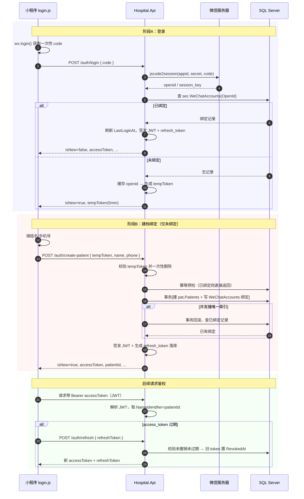

# 微信一键登录核心逻辑

> 说明：本文梳理「微信一键登录」的端到端流程、Token 体系与关键设计点。
> 接口实现细节见 [WECHAT_LOGIN_IMPL.md](WECHAT_LOGIN_IMPL.md)；数据库脚本见 [database/](../database/)。
> 梳理时间：2026-08-13（此时已修复重复建档 500、微信表缺失 500）。

## 一、整体架构

```
小程序 (hospital-miniapp)         后端 API (Hospital.Api)        微信服务器         SQL Server
        │                              │                            │                 │
  wx.login() 拿一次性 code             │                            │                 │
        │────── code ────────────────▶│ POST /auth/login            │                 │
        │                              │────── code2session ──────▶│                 │
        │                              │◀───── openid/session_key ──│                 │
        │                              │── 查 sec.WeChatAccounts ──▶│                 │
        │                              │◀──── 是否已绑定 ────────────│                 │
```

**核心思想**：微信 `openid` 是用户唯一身份标识。系统以「openid ↔ 患者」绑定关系区分新老用户：
首次微信登录 → 建档（填姓名/手机号）并绑定；之后一键直达登录。

| 角色 | 位置 |
|------|------|
| 小程序登录页 | `hospital-miniapp/pages/login/login.js` |
| 小程序微信服务 | `hospital-miniapp/services/wechat-auth-service.js` |
| 后端控制器 | `src/Hospital.Api/Controllers/MiniProgramAuthController.cs` |
| 认证核心 | `src/Hospital.Infrastructure/ExternalServices/WeChatAuthService.cs` |
| 微信 API 客户端 | `src/Hospital.Infrastructure/ExternalServices/WeChatHttpClient.cs` |
| JWT 签发 | `src/Hospital.Infrastructure/ExternalServices/JwtTokenService.cs` |
| DTO | `src/Hospital.Application/DTOs/WeChatAuthDTOs.cs` |
| 数据库表 | `sec.WeChatAccounts`（绑定）、`sec.PatientRefreshTokens`（refresh_token）、`pat.Patients`（患者） |

## 二、核心流程（两阶段）

### 阶段 A：登录 `POST /api/miniprogram/auth/login`

**步骤 1 — code 换 openid**（`WeChatHttpClient.Code2SessionAsync`）
小程序 `wx.login()` 获取一次性 `code`，后端调微信 `jscode2session` 换取 `openid`。

- `code` 微信侧**一次性**：用过即失效（`errcode 40163`），故"失败重新点登录"即可
- 常见错误码转可读提示：`40029` 凭证失效、其他原样透出 `errcode`/`errmsg`

**步骤 2 — 查绑定**（`WeChatAuthService.LoginAsync`）
用 `openid` 查 `sec.WeChatAccounts`：

| 分支 | 处理 | 响应 |
|------|------|------|
| 已绑定 | 刷新 `LastLoginAt` → 签发 JWT + refresh_token | `isNew=false`，带 `accessToken/refreshToken/patientId/patientNo/name` |
| 未绑定 | `openid` 存入内存缓存 → 返回一次性 `tempToken`（默认 5 分钟） | `isNew=true`，带 `tempToken/expiresIn` |

```jsonc
// 已绑定
{ "accessToken": "eyJ...", "refreshToken": "A1B2...", "patientId": 15,
  "patientNo": "P202608130002", "name": "小王", "isNew": false }
// 未绑定
{ "tempToken": "5f8a...", "expiresIn": 300, "isNew": true }
```

### 阶段 B：建档绑定 `POST /api/miniprogram/auth/create-patient`

仅 `isNew=true` 时走到这里。小程序弹出姓名/手机号输入框（`login.js` `onConfirmName`），提交后：

1. **tempToken 换回 openid 并立即删除** — 一次性，防重复提交建档
2. **幂等预检** — 再次查绑定，已绑定直接返回已有患者（不重复建档）
3. **同一事务**建患者 + 写绑定：
   - `PatientNoService.NextNoAsync()` 生成病历号 → 建 `pat.Patients`
   - 写 `sec.WeChatAccounts`（openid → patientId，`IX_WeChatAccounts_OpenId` 唯一索引）
4. **并发兜底**：两个请求同时建档时，第二个撞唯一索引抛 `DbUpdateException`（SQL Server 2601/2627）→ 事务回滚 → `ChangeTracker.Clear()` 丢弃脏状态 → 查出已绑定记录直接返回（**修复重复建档 500 的关键**）
5. 签发 JWT + refresh_token 落库，返回 `isNew=true`

## 三、Mermaid 时序图



## 四、Token 体系

| Token | 形式 | 用途 | 生命周期 |
|-------|------|------|----------|
| `accessToken` | JWT，HS256，claims 含 `patientId` + `userType=patient` | 接口鉴权（`/auth/me`、挂号等） | `WeChat:Jwt:AccessTokenExpiryMinutes`（默认 120），过期需刷新 |
| `refreshToken` | 128 位随机 hex | 换新 access_token，可撤销 | 默认 30 天，落库 `sec.PatientRefreshTokens` |

- **换新**：`POST /auth/refresh` 校验 refresh_token 未撤销且未过期 → 旧 token 置 `RevokedAt` → 发新对
- **退出**：`POST /auth/logout` 按 `patientId + refreshToken` 撤销 → 防 token 续期滥用
- **鉴权**：`/auth/me` 从 JWT `NameIdentifier` 取 patientId

## 五、关键设计点与坑（按踩坑顺序）

1. **`EnsureCreated()` 不增量建表** → 微信表缺失导致登录 500。由 `database/01_create_schema.sql` 建表兜底
2. **code 一次性** → `errcode 40163` 不是 bug，重试即可
3. **tempToken 一次性** → 双击"一键登录"不会重复建档
4. **唯一索引 + 事务 + 重复键兜底** → 并发下也只有一个患者
5. **tempToken 存进程内 `IMemoryCache`** → 单机部署没问题；将来多实例需换 Redis 共享

## 六、接口清单

| 接口 | 方法 | 鉴权 | 说明 |
|------|------|------|------|
| `/api/miniprogram/auth/login` | POST | 无 | code 登录，返回 JWT 或 tempToken |
| `/api/miniprogram/auth/create-patient` | POST | 无（凭 tempToken） | 建档 + 绑定微信 |
| `/api/miniprogram/auth/refresh` | POST | 无（凭 refreshToken） | 刷新 access_token |
| `/api/miniprogram/auth/me` | GET | JWT | 当前患者资料 |
| `/api/miniprogram/auth/logout` | POST | JWT | 退出并撤销 refresh_token |
